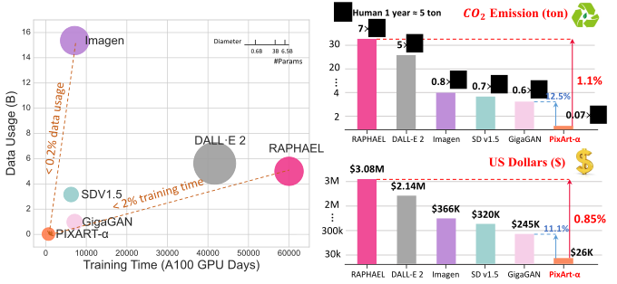

<p align="center">
  
</p>


### <div align="center">👉 PixArt-α: Unleashing your Creativity <div> 

<div align="center">

[](https://huggingface.co/spaces/PixArt-alpha/PixArt) &ensp; [](https://github.com/PixArt-alpha/PixArt) &ensp; [](https://arxiv.org/abs/2310.00426)

</div> 

---

Official implementation of **[PixArt-α: Fast Training of Diffusion Transformer for Photorealistic Text-to-Image Synthesis](https://arxiv.org/abs/2310.00426)**.

---


---

## 🚩 **New Features/Updates**
- ✅ Oct. 15, 2023. Release [PixArt-α](https://github.com/PixArt-alpha/PixArt).

---

# 🔥🔥🔥 Why PixArt-α? 
## Training Efficiency



## High-quality Generation from PixArt-α.

- More samples
<div id="dreambooth" style="display: flex; justify-content: center;">
  
  
</div>

- PixArt + Dreambooth
<div id="dreambooth" style="display: flex; justify-content: center;">
  
  
</div>

- PixArt + ControlNet
<div id="dreambooth" style="display: flex; justify-content: center;">
  
  
</div>

# 🔧 Dependencies and Installation

- Python >= 3.10 (Recommend to use [Anaconda](https://www.anaconda.com/download/#linux) or [Miniconda](https://docs.conda.io/en/latest/miniconda.html))
- [PyTorch >= 1.13.0+cu11.7](https://pytorch.org/)
```bash
conda create -n pixart python==3.9.0
conda activate pixart
cd path/to/pixart
pip install torch==2.0.0+cu117 torchvision==0.15.1+cu117 torchaudio==2.0.1 --index-url https://download.pytorch.org/whl/cu117
pip install -r requirements.txt
```

# ⏬ Download Models 
All models will be automatically downloaded. You can also choose to download manually from this [url](https://huggingface.co/PixArt-alpha/PixArt).

# 💻 How to Test
Inference requires at least `23GB` of GPU memory.

## Quick start with [Gradio](https://www.gradio.app/guides/quickstart)

To get started, first install the required dependencies:

```bash
python scripts/interface.py --model_path path/to/model.pth --image_size=1024 --port=12345
```
Let's have a look at a simple example using the `http://your-server-ip:port`.

## Online Demo [](https://huggingface.co/spaces/PixArt-alpha/PixArt) 


...

## 🔥To-Do List

- [ ] diffusers version
- [ ] training code
- [x] inference code & model

[//]: # (https://user-images.githubusercontent.com/73707470/253800159-c7e12362-1ea1-4b20-a44e-bd6c8d546765.mp4)

# 🤗 Acknowledgements
- Thanks to [DiT](https://github.com/facebookresearch/DiT) for their wonderful work and codebase.

# BibTeX
    @misc{chen2023pixartalpha,
          title={PixArt-$\alpha$: Fast Training of Diffusion Transformer for Photorealistic Text-to-Image Synthesis}, 
          author={Junsong Chen and Jincheng Yu and Chongjian Ge and Lewei Yao and Enze Xie1 and Yue Wu and Zhongdao Wang and James Kwok and Ping Luo and Huchuan Lu and Zhenguo Li},
          year={2023},
          eprint={2310.00426},
          archivePrefix={arXiv},
          primaryClass={cs.CV}
    }
